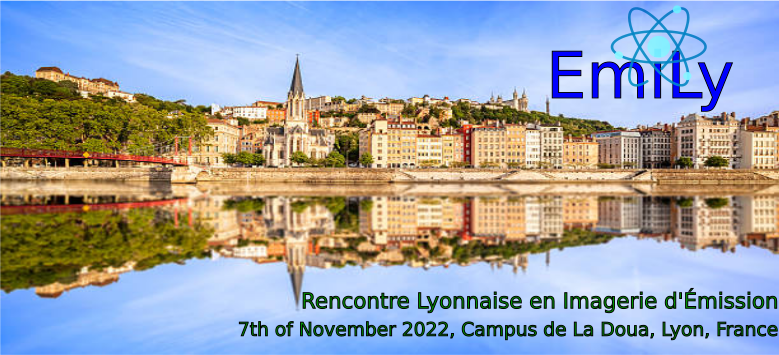

---
# Feel free to add content and custom Front Matter to this file.
# To modify the layout, see https://jekyllrb.com/docs/themes/#overriding-theme-defaults

layout: home
title: EmiLy 
subtitle: Rencontre Lyonnaise en Imagerie d'Émission
#  
---

 7th of November 2022, INSA Lyon, Lyon, France

 

## Objectives of the Workshop

- Bring together European teams working in emission imaging 
- Create or strengthen connections and collaborations 
- Give young researchers the opportunity to present their work and meet leading researchers in the field in a friendly environment

## Topics

- New developments in detectors
- Acquisition modeling, tomographic reconstruction
- Recent advances and applications of deep learning methods  
- New cutting-edge applications

  
  
  

 

